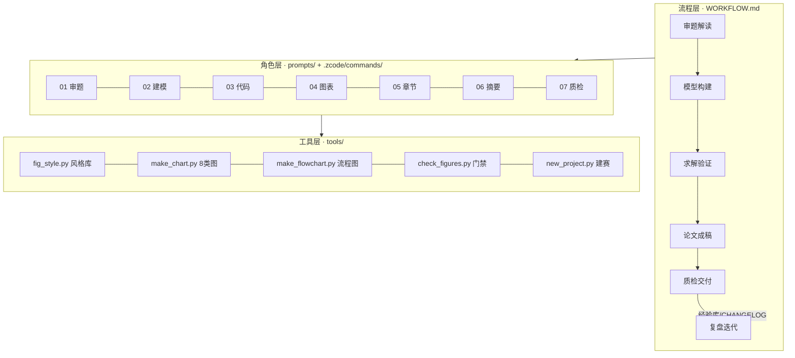

# 数模工作区 · 高教社杯国赛（CUMCM）

> **一句话**：一套「AI 生产、人判断、门禁拦截、单一事实源」的 72 小时国赛作战系统。
> **2026 赛程**：9 月 10 日（周四）18:00 → 9 月 13 日（周日）20:00
> （[第一次通知](https://www.cmathc.org.cn/mcm/tz/418.html)）。

## 1. 目录导航（先看这里）

| 去哪 | 干什么 |
|---|---|
| `WORKFLOW.md` | 72h 作战手册：时间轴门禁 / S1–S10 场景 SOP |
| `AGENTS.md` | AI 会话自动遵守：意图路由 / **token 节流纪律** / 自我迭代协议 |
| `00_标准/交付物标准.md` | **唯一验收口径**：官方硬条款 10 条 + D1–D6 交付物验收动作 |
| `00_标准/论文模板/CUMCM_国赛/` | 官方格式 **Word** 模板（按 2026 规范预设版式）+ 用法 |
| `01_资料库/高星开源项目索引.md` | GitHub 高星数模项目精准索引 + 官方信息源 |
| `01_资料库/创新表达句式库.md` | **表达句式库**：平实而突出——套话/AI 腔两份黑名单 + 数值句式 + 消融式结论 |
| `01_资料库/本地资料/` | 写作通识手册、论文结构图、旧论文批注 |
| `prompts/` | 7 张 AI 角色卡（审题/建模/代码/图表/章节/摘要/质检） |
| `templates/` | 论文骨架 / 摘要 / 模型卡片等模板（论文排版用 00_标准 的 Word 模板） |
| `tools/` | 图表与流程图工具链 + 文-图-册一致性检查脚本 |
| `projects/` | 每年每题一个项目目录（`new_project.py` 生成） |
| `90_复盘/` | 复盘模板 + 经验库（自我迭代的载体） |
| `协作接口/` | **团队协作枢纽**：建模手/编程手成果投递口（规范见其 README） |
| `99_归档/` | 历史杂件，只进不改 |
| `CHANGELOG.md` | 结构性修改流水账 |

## 2. 三分钟上手

```bash
# ① 看示例图库（8 类论文图表 + 2 张流程图）
python tools/make_chart.py gallery
python tools/make_flowchart.py --demo route --outdir tools/output

# ② 开赛日：一键建赛（生成 projects/2026X_题名/ 全套目录+模板）
python tools/new_project.py 2026C_题名

# ③ 图册登记后：文-图-册一致性自动检查
python tools/check_figures.py projects/2026C_题名

# ④ 正式排版：用官方格式模板（详见 00_标准/论文模板/CUMCM_国赛/README.md）
#    电子版提交用 withoutpreface 选项，保证第一页 = 摘要专用页

# ⑤ 论文整卷装配：正文+图表+附录代码一键进官方 Word 模板
#    python projects/<赛题>/03_代码/build_paper.py  →  05_论文/论文初稿_完整版.docx

# ⑥ ZCode 斜杠命令：/审题 /建模 /绘图 /写章节 /摘要 /质检 /审查 /复盘 /建赛
```

环境：Python ≥ 3.9 + `pip install -r tools/requirements.txt`；论文排版用 Word
（模板已内置，定稿另存 PDF），无需 LaTeX。

## 3. 2026 官方硬条款（完整 10 条见 交付物标准.md）

正文 ≤30 页不要目录；摘要页 ≤1 页；电子版单文件 ≤20MB 且**第一页必须是摘要页**；
支撑材料单包 ≤20MB **必须含全部可运行源程序**；全稿无身份信息——违反可能取消评奖资格。

## 4. 系统架构



## 5. 对标与借鉴（GitHub 高星，详见 01_资料库/）

| 来源 | 借鉴了什么 | 落在哪 |
|---|---|---|
| [MathModelAgent](https://github.com/jihe520/MathModelAgent)（4166★） | 阶段化流水线、"每阶段有产出物"契约 | WORKFLOW 门禁 |
| [math-modeling-skill](https://github.com/XiaoMaColtAI/math-modeling-skill)（1089★） | 渐进式加载、阶段质检、复现清单 | AGENTS.md §2、交付物标准 D4 |
| [math-modeling-skills](https://github.com/Lupynow/math-modeling-skills)（303★） | 文献检索硬上限（≤5 篇）、去 AI 味、四轮自审 | AGENTS.md §2.2、prompts/07 |
| [CUMCMThesis](https://github.com/latexstudio/CUMCMThesis)（1167★） | 官方格式规范条款对照来源（2026 + AI 声明）；LaTeX 版已归档备用 | 00_标准/论文模板/（Word 模板） |
| [modelviz-skill](https://github.com/hrdZhu/modelviz-skill)（89★）/ [sci-box](https://github.com/jihe520/sci-box)（85★）/ [SciencePlots](https://github.com/garrettj403/SciencePlots)（9202★） | 表达目标选图、低饱和版式、成图自检；SHAP/ROC/Chord 等高阶图型与可编辑技术路线图 | tools/ v2 引擎（18 种图型）+ 01_资料库 索引 |

## 6. AI 角色一览

| 角色卡 | 使命 | 时刻 |
|---|---|---|
| [01 审题分析师](prompts/01_审题分析师.md) | 拆题、数据字典、问题树、选题打分 | T+0–2h |
| [02 建模军师](prompts/02_建模军师.md) | 方法选型对比、模型卡片、假设清单 | D1 |
| [03 代码工程师](prompts/03_代码工程师.md) | 可复现求解代码 + 结果 CSV | 全程 |
| [04 图表设计师](prompts/04_图表设计师.md) | 出图流水线、审图十查 | 全程 |
| [05 章节写手](prompts/05_章节写手.md) | 四段式逐章成稿 | D1–D3 |
| [06 摘要大师](prompts/06_摘要大师.md) | 五要素摘要 + 三轮打磨 | T+52–60h |
| [07 审稿质检员](prompts/07_审稿质检员.md) | P0/P1/P2 问题单，提交门禁 | T+60–72h |
| [09 总揽审查官](prompts/09_总揽审查官.md) | 对抗式审查队友成果：题意符合性/建模-代码一致/优化空间/创新点 | G3–G5 每次投递后 |

## 7. 自我迭代怎么转

赛后 48h：`/复盘` → `projects/<赛题>/07_复盘/复盘.md` + 经验库追加 →
同类坑出现 ≥2 次固化进模板/工具/规范 → 结构性改动登记 `CHANGELOG.md`。
下次开赛时，工作区已经带着上一次的教训。

## 8. 已知边界（诚实声明）

- 答辩 PPT 工作流（旧版所称 ppt_studio）未建设，旧工程已归档 `99_归档/2026-09-05_清理/ppt_studio/`。
- 备考刷题工作流（旧版所称 exam_gym）不存在，从未建成，文档引用已清除。
- 本工作区不代替提交：AI 产出必须经人工验收（参赛规则 2026 第 6 条，
  队对原创性/真实性/准确性负全责）。

---
*2026-09-05 v2.0 重构，变更明细见 [CHANGELOG.md](CHANGELOG.md)。*
